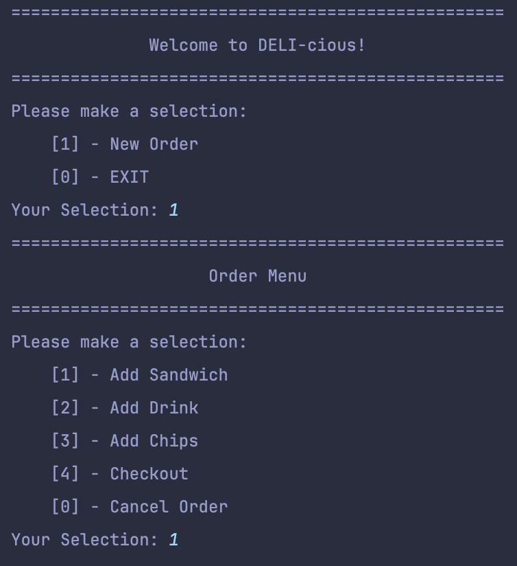
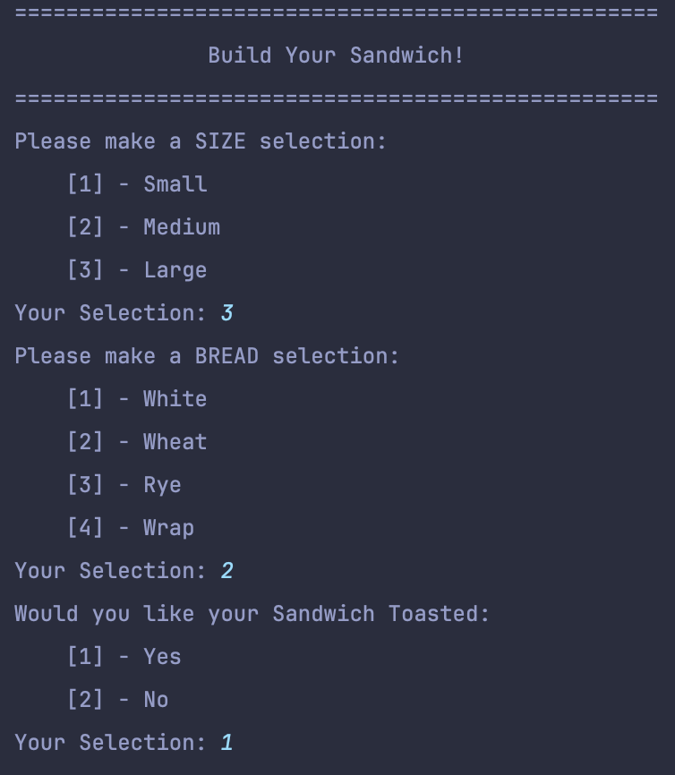
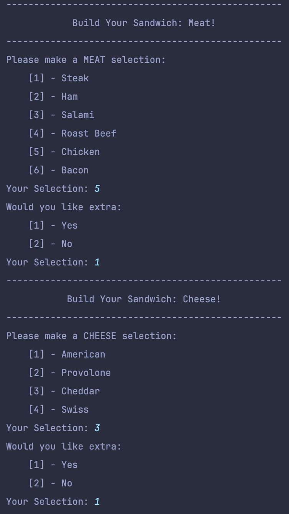
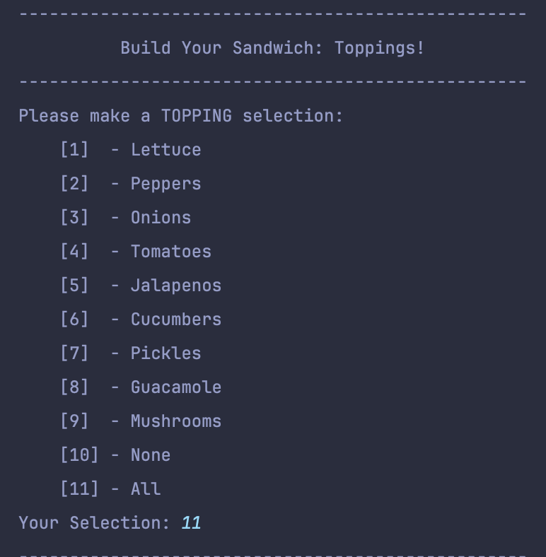
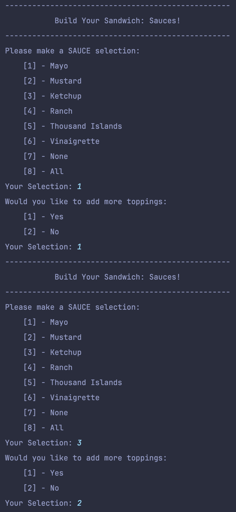
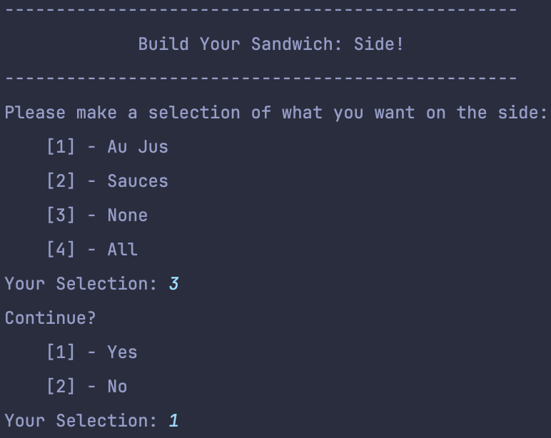
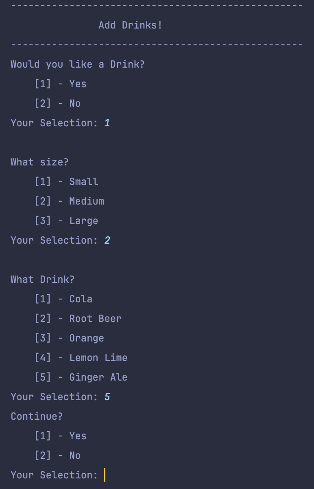
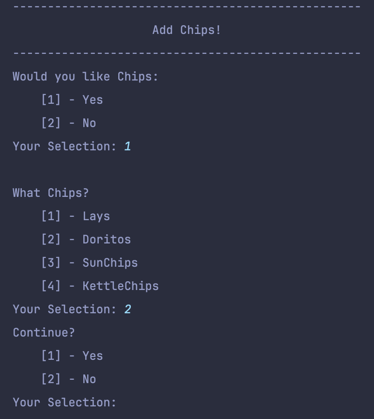
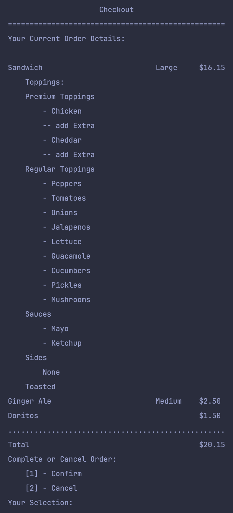

# DELI-cious Sandwich Shop
## Table of Contents:
> 1. [Introduction](#Introduction)
> 2. [Design Process](#design-process)
>    1. [UML Diagram](#uml-diagram)
> 3. [Coding](#coding)
>    1. [Concepts Used](#concepts-used)
>    2. [UserInterface, Enums, and Controller](#userinterface-enums-and-controller)
> 4. [Results](#results)
>    1. [Screenshots](#screenshots)

## Introduction
This project aims to develop a user-friendly POS application for DELI-cious,
a custom sandwich shop. The application will address their growing business needs by streamlining the order process and 
laying the groundwork for future online ordering. Built with OOP principles, the application will allow customers to fully
customize their sandwiches, including size, bread type, toppings (regular and premium with extra options), and toasting. 
Additionally, customers can add drinks and chips to their orders.  For confirmation and verification, the application will 
display the complete order details and total cost. Finally, each confirmed order will be saved as a unique timestamped 
text file within a designated "receipts" folder.

## Design Process
Just like the previous capstone, I wanted to implement an application utilizing MVC Architecture. I also wanted to implement
as much OOP concepts as I can. Through this I started with a UML Diagram then moved on to coding. Some things within the diagram
ended up being changed throughout the coding process since I needed more and more methods.
### UML Diagram

## Coding
### Concepts Used
This capstone was to exercise our knowledge of Object Oriented Programming, and I think I did just that! I was able to 
exercise all 4 pillars of OOP: 

    1. Encapsulation
    2. Inheritance
    3. Abstraction
    4. Polymorphism

With this I was able to implement `classes`, `abstract classes`, `interfaces`, and more.

I was able to exercise other coding concepts as well:

    1. MVC Architecture
    2. Enums
    3. Streams
    4. Unit Testing


### UserInterface, Enums, and Controller
My previous feedback on past exercises and workshops was the usage of the Controller in MVC architecture. In previous work,
I didn't truly understand how the Controller portion worked. At first, I had all the user input, logic, and output in the 
UserInterface class and just instances in the Controller, which wasn't MVC. With this project, I was able to challenge myself
with separating Input/Output and Logic with the UserInterface and Controller. To help me with this, I also challenged myself
using enums! See Examples Below:
```java
// From UserInterface.java
public CheeseChoice getCheese() {
    while(true) {
        System.out.print(
                "-".repeat(50) + "\n" +
                        " ".repeat(11) + "Build Your Sandwich: Cheese!" + "\n" +
                        "-".repeat(50) + "\n" +
                        """
                                Please make a CHEESE selection:
                                \t[1] - American
                                \t[2] - Provolone
                                \t[3] - Cheddar
                                \t[4] - Swiss
                                """);
        try {
            System.out.print("Your Selection: ");
            int choice = Integer.parseInt(userInput.nextLine().strip());
            CheeseChoice cheeseChoice = switch (choice) {
                case 1 -> CheeseChoice.American;
                case 2 -> CheeseChoice.Provolone;
                case 3 -> CheeseChoice.Cheddar;
                case 4 -> CheeseChoice.Swiss;
                default -> null;
            };
            if (cheeseChoice != null) return cheeseChoice;
            else System.out.println("Invalid Choice: Try Again.");
        } catch (Exception _) {
            System.out.println("Invalid Choice: Try again.");
        }
    }
}
```
```java
// From DeliApp.java (Controller)
private PremiumTopping handleCheeseChoice() {
    CheeseChoice choice = ui.getCheese();
    String cheese = switch (choice) {
        case CheeseChoice.American -> "American";
        case CheeseChoice.Provolone -> "Provolone";
        case CheeseChoice.Cheddar -> "Cheddar";
        case CheeseChoice.Swiss -> "Swiss";
        default -> throw new IllegalStateException("Unexpected value: " + choice);
    };
    // getIsExtra
    boolean isExtraCheese = ui.getIsExtra();

    return new PremiumTopping("Cheese", cheese, isExtraCheese);
}
```
Using both the UserInterface and the Controller, I was able to create code that returns a new Instance of a cheese PremiumTopping.
The UserInterface became JUST for user interaction while the controller now deals with program interaction.

## Results

### Screenshots
Here is some screenshots of the Application and its Outcome.
#### Application Running










#### Outcome

This shows a receipt of with the current naming convention being [Date-Time.txt]